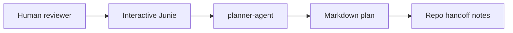

# Milestone One Local Coordination Plan

## Source

- Source document: `.junie/plans/0001-AI-Orchestration.md`.
- Selected scope: milestone #1.
- Selected orchestration shape: local files.
- Active repository: `sadist-planner` only.
- Tracking artifact: `.junie/tracking/milestone-one-local-coordination.md`.

## Goal

Create a small, human-reviewable local coordination workflow for
`sadist-planner` where an interactive `planner-agent` produces
Markdown plans and a future interactive `repo-agent` can safely make
approved coordination-repo changes.

The milestone proves the command-center model before any target
application repository is enrolled or automated.

## Non-goals

- Do not run `repo-agent` in backend, frontend, or other application
  repositories.
- Do not enroll target repositories in the coordination workflow yet.
- Do not add issue templates, pull request templates, or routing labels.
- Do not add GitHub Actions, label-triggered workflows,
  cross-repo dispatching, chatbot integration, or status aggregation.
- Do not add a generalized command layer beyond the existing
  `.junie/commands/*.md` slash-command prompts.
- Do not perform Git or GitHub operations as part of this plan.

## Milestone boundaries

Milestone #1 preserves the selected local-files architecture:

1. A human reviewer provides a planning source or task.
2. Interactive Junie starts `planner-agent` from this repo.
3. `planner-agent` writes a Markdown plan under `.junie/plans/`.
4. The plan may include repo handoff notes for later work.
5. Human review happens before implementation begins.

The following work is deferred to later milestones:

- target-repo `repo-agent` execution;
- repository enrollment for backend, frontend, or other application
  repositories;
- issue templates, pull request templates, and routing labels;
- GitHub Actions or remote headless agent execution;
- deterministic GitHub command wrappers beyond current slash-command
  prompts;
- cross-repo dispatching;
- status aggregation across plans, issues, pull requests, and workflow
  runs;
- chatbot or messenger integration.

Future application-repo work may be recorded only as handoff notes in
milestone #1. Those notes must not be treated as permission to edit,
branch, push, or open pull requests in target repositories.

## Affected repositories

### Active

- `sadist-planner`: coordination repository for local planning files,
  agent prompts, command prompts, workflow checks, and handoff notes.

### Future handoff only

- Application repositories in the `my-handicapped-pet` organization may
  be named in handoff notes later, but they are not execution targets in
  milestone #1.

## Interface or contract changes

### `planner-agent` contract

- Prompt source: `.junie/agents/planner-agent.md`.
- Command prompt: `.junie/commands/planner-agent.md`.
- Input: rough idea, issue text, or planning document.
- Output: concise Markdown plan under `.junie/plans/`.
- Required content: goal, non-goals, affected repositories,
  interface or contract changes, acceptance criteria, test strategy,
  rollout notes, and handoff for each affected repo.
- Handoff rule: use `.junie/templates/repo-handoff.md` when future
  repo-scoped implementation work is identified.
- Source edit rule: `.junie/plans/0001-AI-Orchestration.md` may be
  edited only in sections titled `Written by the AI Agent`.

### `repo-agent` contract

- Prompt source: `.junie/agents/repo-agent.md`.
- Command prompt: `.junie/commands/repo-agent.md`.
- Milestone #1 scope: approved coordination-repo changes in
  `sadist-planner` only.
- Boundary: do not run in target application repositories until a later
  enrollment milestone is explicitly approved.
- Branch and pull request behavior: prepare or open pull requests only
  when the user explicitly requests it or the current task requires it.
- Commit behavior: commit only when explicitly requested by the user.

### Local workflow contract

Before any future Git or GitHub operation, the acting agent must follow
`.junie/workflows/local-coordination.md`:

1. Confirm the coordination repo root.
2. Read `.junie/AGENTS.md` and the task-specific plan.
3. Check `git status --short`.
4. Confirm the current branch with `git branch --show-current`.
5. Check `gh --version` when issue or pull request work is needed.
6. Check `gh auth status` when issue or pull request work is needed.
7. Stop and ask the user if unrelated changes, authentication problems,
   or an unexpected branch appear.

### Directory contract

- Human-facing plans belong under `.junie/plans/`.
- Internal task trackers, delivery-step status files, and execution
  notes belong under `.junie/tracking/`.
- Agent prompts, command prompts, handoff templates, and workflow files
  remain under their existing `.junie/agents/`, `.junie/commands/`,
  `.junie/templates/`, and `.junie/workflows/` directories.

### Handoff contract

Future handoff notes must use this shape from
`.junie/templates/repo-handoff.md`:

- plan link or file;
- affected repository;
- goal;
- acceptance criteria;
- test strategy;
- expected branch or pull request shape;
- interface notes;
- final status summary, including blockers.

## Acceptance criteria

- [ ] `planner-agent`, running interactively in `sadist-planner`, can
  read `.junie/plans/0001-AI-Orchestration.md` and produce a plan under
  `.junie/plans/`.
- [ ] If `.junie/plans/0001-AI-Orchestration.md` is edited, changes are
  limited to sections titled `Written by the AI Agent`.
- [ ] `repo-agent`, running interactively in `sadist-planner`, can use
  the local workflow to prepare coordination-repo planning changes.
- [ ] Future branch and pull request work is guarded by the pre-flight
  sequence in `.junie/workflows/local-coordination.md`.
- [ ] Both agents can update a coordination-repo branch and pull request
  only when that work is explicitly approved by the user.
- [ ] Target application repository execution remains deferred.

## Test strategy

- Inspect this plan for the required `planner-agent` sections: goal,
  non-goals, affected repositories, interface changes, acceptance
  criteria, test strategy, rollout notes, and repo handoff notes.
- Confirm all future Git and GitHub work points to
  `.junie/workflows/local-coordination.md` pre-flight checks.
- Confirm target application repositories are represented only as future
  handoff targets.
- Confirm handoff notes follow `.junie/templates/repo-handoff.md`.

## Rollout notes

- Start with manual Junie sessions from the `sadist-planner` repository
  root.
- Use `/planner-agent` for planning tasks and require human review
  before implementation.
- Use `/repo-agent` only for approved coordination-repo changes.
- Run Git and GitHub pre-flight checks before any future branch, pull
  request, issue, push, or authentication-sensitive operation.

## Repo handoff

### Plan Link or File

- Plan: `.junie/plans/0002-Milestone-One-Local-Coordination.md`

### Affected Repo

- Repository: `sadist-planner`

### Goal

- Keep the local coordination workflow explicit, manual, and reviewable
  for milestone #1.

### Acceptance Criteria

- [ ] Required plan sections are present.
- [ ] Future Git and GitHub work is gated by the local pre-flight
  workflow.
- [ ] Future target-repo work is captured only as handoff notes.

### Test Strategy

- Validate by Markdown inspection and consistency checks against the
  agent prompts, command prompts, workflow file, and handoff template.

### Expected Branch or PR Shape

- Branch: `agents/milestone-one-local-coordination`
- Pull request title: `Document milestone one local coordination plan`

### Interface Notes

- The coordination repo is the only active repo for this milestone.
- Handoff notes for future application repositories must use this
  template shape before a later `repo-agent` run.

### Final Status Summary

- Status: local coordination plan drafted for human review.
- Blockers: none for documentation review; future GitHub work requires
  pre-flight checks and explicit user approval.

## Final status summary

- Drafted the milestone #1 local-files coordination plan for
  `sadist-planner`.
- Captured manual `planner-agent` and future `repo-agent` boundaries,
  required pre-flight checks, acceptance criteria, rollout notes, and
  handoff shape.
- Deferred target-repo execution and automation to later milestones.