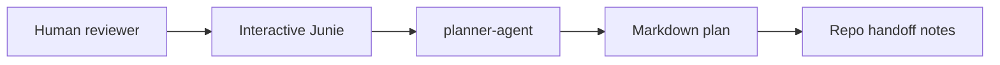

> Tracking artifact: this file records the execution plan and step
> status for the milestone-one local coordination task. The canonical
> human-facing milestone plan is
> `.junie/plans/0002-Milestone-One-Local-Coordination.md`.

# Requirements

### Overview & Goals
Create a human-reviewable milestone #1 implementation plan for the `sadist-planner` coordination repository, based on `.junie/plans/0001-AI-Orchestration.md` and the selected `Local files` orchestration shape.

The outcome is a small, manual-first coordination workflow where:

- `planner-agent` turns a source idea, issue, or planning file into a Markdown plan under `.junie/plans/`.
- `repo-agent` handles approved coordination-repo changes safely.
- Git and GitHub activity remains explicit and guarded by `.junie/workflows/local-coordination.md` pre-flight checks.
- Future target-repo work is represented only as handoff notes, not executed from milestone #1.

### Scope

#### In Scope

- Use `.junie/plans/0001-AI-Orchestration.md` as the source of truth for milestone #1.
- Preserve the existing local/manual model documented in `README.md`, `.junie/agents/planner-agent.md`, `.junie/agents/repo-agent.md`, and `.junie/workflows/local-coordination.md`.
- Ensure the plan covers the required `planner-agent` content areas:
  - Goal.
  - Non-goals.
  - Affected repositories.
  - Interface or contract changes.
  - Acceptance criteria.
  - Test strategy.
  - Rollout notes.
  - Handoff for each affected repo.
- Use `.junie/templates/repo-handoff.md` as the standard handoff shape when future `repo-agent` work is identified.
- Keep target application repositories out of scope for execution in milestone #1.

#### Out of Scope

- Running `repo-agent` in backend, frontend, or other application repositories.
- Adding GitHub Actions, label-triggered workflows, cross-repo dispatching, chatbot integration, or status aggregation.
- Implementing a generalized command layer beyond the current `.junie/commands/*.md` slash-command prompts.
- Performing Git or GitHub operations as part of this planning-only work.

### User Stories

- As the solo developer, I want a concrete milestone #1 plan so that I can review the local coordination workflow before implementation proceeds.
- As `planner-agent`, I want clear source, output, and handoff rules so that planning runs produce consistent Markdown artifacts.
- As `repo-agent`, I want explicit pre-flight and PR-preparation rules so that coordination-repo changes are made safely.
- As a future target-repo implementer, I want standardized handoff notes so that repo-scoped work can be picked up later without ambiguity.

### Functional Requirements

- The milestone #1 plan must identify `sadist-planner` as the only active affected repository.
- The plan must document that `.junie/plans/0001-AI-Orchestration.md` may only be edited in sections titled `Written by the AI Agent`, matching lines 32–39 and `.junie/agents/planner-agent.md` lines 21–24.
- The plan must describe the local-file flow selected by the user:



- The plan must state that `.junie/workflows/local-coordination.md` pre-flight checks are required before any future Git or GitHub operation.
- The plan must include acceptance criteria corresponding to milestone #1 in `.junie/plans/0001-AI-Orchestration.md` lines 305–317.
- The plan must include a concise final status summary suitable for a pull request body, as required by `.junie/agents/planner-agent.md` line 54.

# Technical Design

### Current Implementation

The coordination repository is intentionally small and document-driven:

- `README.md` describes the repo as a local coordination repo for `my-handicapped-pet.io`, with manual Junie usage for `planner-agent` and `repo-agent`.
- `.junie/agents/planner-agent.md` defines the planning role, required plan content, local workflow, output rules, and the instruction to use `.junie/templates/repo-handoff.md` when handoff notes are needed.
- `.junie/agents/repo-agent.md` defines repo-scoped implementation behavior, including safe branch/PR work and pre-flight requirements.
- `.junie/commands/planner-agent.md` and `.junie/commands/repo-agent.md` provide the project slash-command prompts.
- `.junie/workflows/local-coordination.md` defines the milestone #1 pre-flight checks, planning sequence, repo change sequence, PR checklist, and deferred work.
- `.junie/templates/repo-handoff.md` defines the future handoff format for repo-scoped implementation work.
- `.junie/plans/0001-AI-Orchestration.md` contains the source essay and an AI-written GitHub-native orchestration proposal.

### Key Decisions

- **Use local Markdown artifacts first.** The selected architecture is `Local files`, matching the source document’s first milestone: manually invoked agents, Markdown plans, and no target-repo execution yet.
- **Keep Git/GitHub guarded, not automatic.** Git and GitHub work is only future implementation behavior and must follow `.junie/workflows/local-coordination.md` pre-flight checks.
- **Treat `sadist-planner` as the only active repo for milestone #1.** Other `my-handicapped-pet` repos may be named in handoffs, but not modified or orchestrated.
- **Prefer documentation contracts over scripts for milestone #1.** The existing `.junie/commands/*.md`, `.junie/agents/*.md`, workflow file, and handoff template are the contract surface.

### Proposed Changes

The milestone #1 implementation should produce or update a Markdown plan under `.junie/plans/` that turns `.junie/plans/0001-AI-Orchestration.md` into an implementation-ready local workflow plan.

The plan should include these sections:

- `Goal`: local manual coordination flow using `planner-agent` and `repo-agent`.
- `Non-goals`: no target-repo execution, no automation layer, no GitHub Actions, no chatbot.
- `Affected repositories`: active `sadist-planner`; future target repos only as handoff placeholders.
- `Interface or contract changes`: agent prompts, slash-command prompts, workflow pre-flight, handoff template, plan-file conventions.
- `Acceptance criteria`: milestone #1 criteria from the source plan, rewritten as checkable items.
- `Test strategy`: documentation inspection and dry-run style validation of command prompts and pre-flight sequence.
- `Rollout notes`: manual invocation first, human review before implementation, Git/GitHub only after pre-flight.
- `Repo handoff`: use `.junie/templates/repo-handoff.md` for future repo-agent tasks.
- `Final status summary`: concise PR-body-ready summary.

### Contracts

#### Planning flow contract

```text
Input:  rough idea | issue text | planning file
Agent:  planner-agent
Output: Markdown plan under .junie/plans/
Review: mandatory human review before implementation
Handoff: repo-handoff.md shape when future repo work exists
```

#### Pre-flight contract for future Git/GitHub work

From `.junie/workflows/local-coordination.md`, future implementation agents must:

1. Confirm the coordination repo root.
2. Read `.junie/AGENTS.md` and the task-specific plan.
3. Check `git status --short`.
4. Confirm the current branch.
5. Check `gh --version` when PR/issue work is needed.
6. Check `gh auth status` when PR/issue work is needed.
7. Stop and ask the user if unrelated changes, auth problems, or an unexpected branch appear.

### File Structure

Expected affected files for implementation of this plan:

- `.junie/plans/0001-AI-Orchestration.md`
  - May be referenced as source.
  - May only be edited in sections whose title says `Written by the AI Agent` if an update is chosen.
- `.junie/plans/<new-milestone-one-plan>.md`
  - Preferred place for the expanded milestone #1 implementation plan, to avoid rewriting the source essay.
- `.junie/templates/repo-handoff.md`
  - Referenced, not necessarily changed.
- `.junie/workflows/local-coordination.md`
  - Referenced as the workflow contract; updated only if gaps are found during implementation.
- `.junie/agents/planner-agent.md`, `.junie/agents/repo-agent.md`, `.junie/commands/*.md`
  - Referenced as existing conventions; updated only if the expanded plan exposes contradictions.

### Risks

- **Plan-vs-source duplication:** A new plan may duplicate `.junie/plans/0001-AI-Orchestration.md`; mitigate by linking the source and keeping the new plan implementation-focused.
- **Scope creep into automation:** The source contains milestone #2 ideas; mitigate by explicitly deferring command-layer automation, GitHub Actions, labels, and chatbot work.
- **Unsafe Git/GitHub assumptions:** Mitigate by keeping all Git/GitHub operations out of the planning step and requiring the pre-flight workflow for later implementation.
- **Target-repo overreach:** Mitigate by limiting milestone #1 to `sadist-planner` and recording only future handoffs for application repos.

# Testing

### Validation Approach

Validation is documentation-oriented because milestone #1 is a coordination-plan change, not application code.

- Inspect the generated or updated Markdown plan for the required sections from `.junie/agents/planner-agent.md`.
- Verify all Git/GitHub operations mentioned in the plan point back to `.junie/workflows/local-coordination.md` pre-flight checks.
- Verify target-repo work is represented only as handoff notes and is not described as executable in milestone #1.
- Verify any handoff section follows `.junie/templates/repo-handoff.md`.

### Key Scenarios

- `planner-agent` receives `.junie/plans/0001-AI-Orchestration.md` as source and produces a reviewable milestone #1 plan.
- A human reviewer can identify goal, non-goals, affected repo, contracts, acceptance criteria, test strategy, rollout notes, and handoff notes without reading the full source essay.
- A future `repo-agent` can use the plan to implement coordination-repo changes without guessing whether target application repos are in scope.

### Edge Cases

- If the implementation edits `.junie/plans/0001-AI-Orchestration.md`, only sections titled `Written by the AI Agent` may change.
- If GitHub issue or PR operations are requested later, pre-flight checks must run first.
- If another target repo is named, it must remain a handoff target only until repo enrollment work is explicitly approved.

# Delivery Steps

### ✓ Step 1: Draft the milestone one plan artifact
A Markdown milestone #1 implementation plan exists under `.junie/plans/` and is based on `.junie/plans/0001-AI-Orchestration.md`.

- Create a focused plan artifact rather than expanding the whole essay inline.
- Capture goal, non-goals, affected repositories, contracts, acceptance criteria, test strategy, rollout notes, and handoff notes.
- Use `sadist-planner` as the only active affected repository.
- Link or reference `.junie/plans/0001-AI-Orchestration.md` as the source document.

### ✓ Step 2: Define local coordination contracts
The plan clearly documents how `planner-agent`, `repo-agent`, command prompts, workflow checks, and handoff notes interact.

- Describe `planner-agent` input and output using `.junie/agents/planner-agent.md` and `.junie/commands/planner-agent.md`.
- Describe `repo-agent` future implementation boundaries using `.junie/agents/repo-agent.md` and `.junie/commands/repo-agent.md`.
- Include the `.junie/workflows/local-coordination.md` pre-flight sequence as the required guard for future Git/GitHub work.
- Reference `.junie/templates/repo-handoff.md` as the handoff contract for future target-repo work.

### ✓ Step 3: Constrain milestone one scope and defer automation
The plan separates the approved local-files workflow from milestone #2 automation ideas.

- Mark target-repo execution, repo enrollment, issue templates, routing labels, GitHub Actions, command wrappers, status aggregation, and chatbot integration as deferred.
- Preserve the selected `Local files` architecture: human reviewer, interactive Junie run, Markdown plan, and handoff notes.
- State that future application-repo work may be recorded as handoff notes but must not be executed in milestone #1.

### ✓ Step 4: Validate the plan against repository conventions
The plan is internally consistent with the existing coordination repository files and ready for human review.

- Check that all required `planner-agent` plan sections are present.
- Check that edit restrictions for `.junie/plans/0001-AI-Orchestration.md` are documented if that file is touched.
- Check that handoff notes match `.junie/templates/repo-handoff.md`.
- Add a concise final status summary suitable for a pull request body.